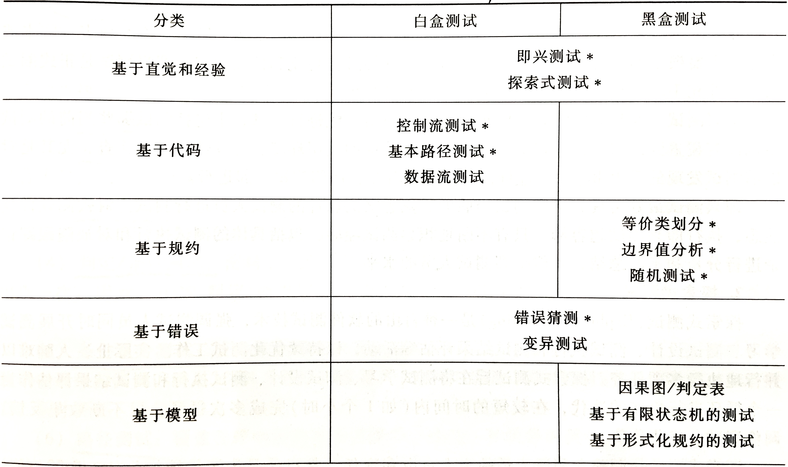
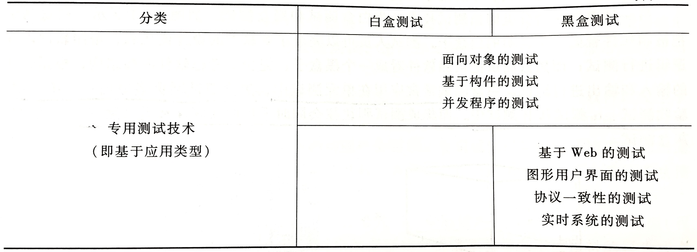

# 软件测试

## 软件测试策略

### 软件测试层次

#### 单元测试

又称模块测试，是针对软件结构中独立的基本单元（函数、类等）进行测试。

重点关注基本单元的接口、局部数据结构、边界条件、独立的路径、错误处理路径。

可以提前到开发之前，即测试驱动开发。

是编码的一部分，应该由程序员完成。

单元测试中涉及的两种特殊模块：

- 驱动模块：用于启动被测模块，相当于被测模块的主程序
- 桩模块：用于代替被测模块需要调用的子模块

#### 集成测试

又称为组装测试，是指根据设计将软件模块组装起来，进行有序的、递增的测试，并通过测试评价它们之间的交互。

有两种：

- 一次性集成：首先对各模块进行单元测试，然后把所有模块集成在一起进行测试
- 增量式测试：首先对各模块进行单元测试，然后将各模块依次集成至较大系统中，在集成的过程中边连接边测试，以发现连接过程中产生的问题
    - 自顶向下集成：从主控模块开始，沿着控制层次结构逐步向下，将桩模块替换为真实模块；不需要驱动模块
    - 自底向上集成：从原子模块开始，向上逐步集成；不需要桩模块
    - 混合集成：中上层使用自顶向下，中下层使用自底向上

一次性集成的缺点是接口错误发现晚、难以进行错误定位，增量式的优点是错误发现早、易于错误定位；一次性的优点是可以并行测试和调试所有软件单元，增量式的缺点是必须顺序测试。

#### 系统测试

软件集成和集成测试完成后，对整个软件系统进行测试。

目的是验证系统是否满足需求规约，包括功能性测试和非功能性测试，其中非功能性测试常常是系统测试的重点，如可靠性测试、性能测试（包括压力测试）、易用性测试、可维护性测试、可移植性测试等。

### 其他软件测试策略

#### 验收测试

#### Alpha 和 Beta 测试

#### 安装测试

#### 回归测试

用来保证软件的改动没有带来不可预期的软件行为或其他错误。

应重新执行所有执行过的测试，或者对受影响的软件部分进行局部回归测试。仅仅对修改的部分进行重新测试是不够的。

## 软件测试技术

测试技术的分类：

### 基于直觉和经验的测试

#### 即兴测试

#### 探索式测试

### 基于代码的测试

#### 控制流测试

包括：

- 语句测试：使每个可执行语句至少执行一次
- 判定测试：使每个判定（整个条件表达式）至少都获得一次“真”和“假”值，也称为分支测试
- 条件测试：使每个判定中的每个条件的可能取值至少满足一次，比判定测试要强，但 100% 条件覆盖不一定满足 100% 判定覆盖
- 判定/条件测试：使判定中的每个条件和每个判定本身的判定结果均至少出现一次，100% 的判定/条件覆盖一定同时满足 100% 的判定覆盖、条件覆盖、语句覆盖
- 条件组合测试：使每个判定中条件的各种可能组合都至少出现一次，是前 5 种测试中最强的测试，满足 100% 条件组合覆盖，一定同时满足上面 4 种覆盖
- 路径测试：覆盖程序中所有可能的路径，考虑了各种判定结果的所有可能组合，但不能替代条件测试、判定/条件测试、条件组合测试

#### 基本路径测试

首先根据程序或程序流程图画出控制流图，并计算其区域数，然后确定一组独立的程序执行路径，最后设计测试用例使每一条基本路径至少执行一次。

如果判定中包含了复合条件，必须先将其转换成等价的简单条件。

在流图中，独立路径至少包含一条在定义该路径之前未曾用到过的边。

#### 数据流测试

### 基于规约的测试

#### 等价类划分

将所有可能的输入数据划分成若干个等价类，然后在每个等价类中选一组（通常是一个）有代表性的数据作为测试用例。

这是白盒测试，划分是从逻辑的角度来进行的，比如需求要求输入的范围在 0～10，则有一个有效等价类（在 0 到 10 范围内）、两个无效等价类（小于 0 和大于 10），不关心代码中的分支等结构。

#### 边界值分析

设计一些测试用例，使软件运行在输入或输出范围的边界附近。

#### 随机测试

### 基于错误的测试

#### 错误猜测

列举程序中所有可能的错误和容易发生错误的特殊情况，然后根据这些猜测设计测试用例。

### 基于模型的测试

#### 因果图/判定表

### 基于应用类型的测试
